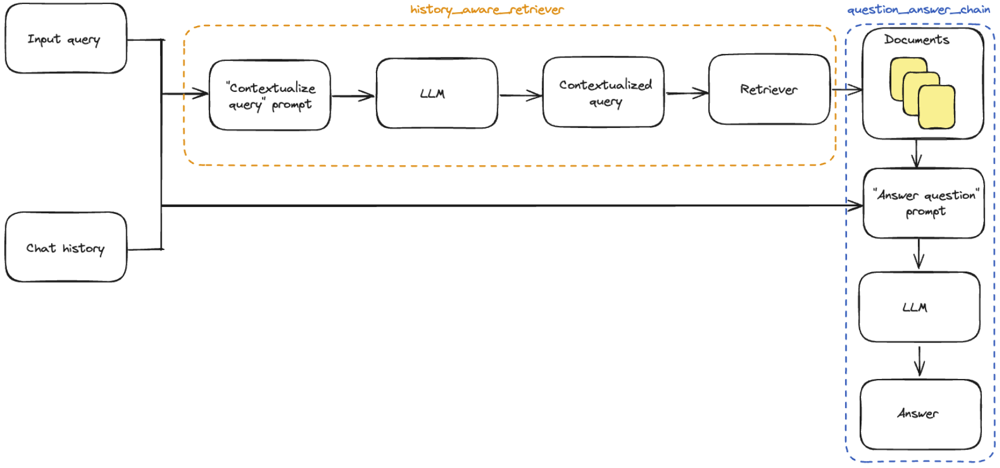
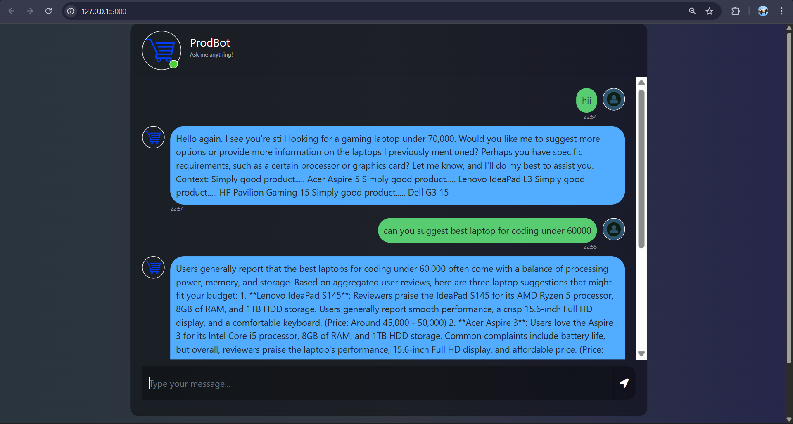
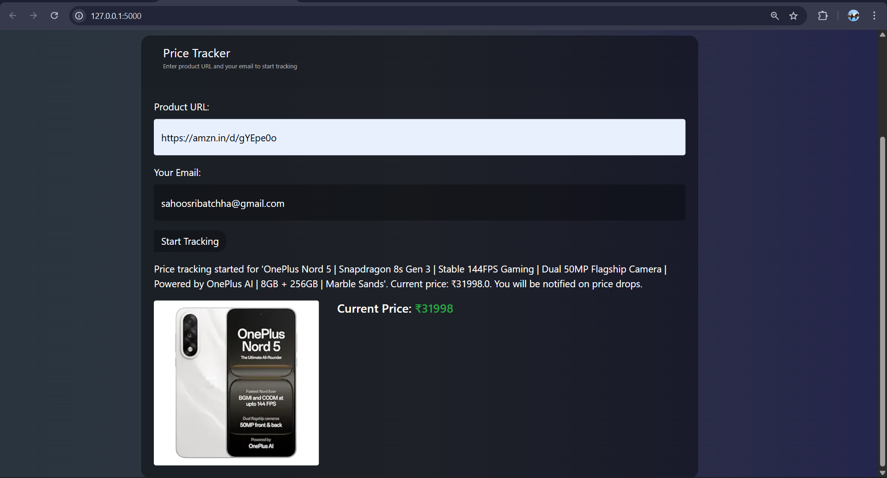

# ProdBot

ProdBot is a Flask-based web application that serves as an intelligent chatbot for tech product recommendations and price tracking. It leverages user reviews and real-world feedback to provide insights on electronic gadgets, and includes automated price monitoring for Amazon products with email notifications.

## Workflow

The application follows this workflow:
1. **Data Ingestion**: Product review data is loaded and processed into a vector store for retrieval.
2. **User Interaction**: Users can chat with the bot or submit Amazon URLs for analysis.
3. **Response Generation**: The bot uses LangChain and Groq LLM to generate responses based on retrieved reviews.
4. **Price Tracking**: Users can start price monitoring for Amazon products, receiving email alerts on price drops.



## Features

- **Tech Product Chatbot**: Ask questions about electronic gadgets (smartphones, laptops, PC components, etc.) and get recommendations based on aggregated user reviews.
- **Amazon Product Analysis**: Provide an Amazon product URL to extract and summarize product details including title, price, rating, reviews, and description.
- **Price Tracking**: Monitor Amazon product prices and receive email alerts when prices drop.
- **Conversational Memory**: Maintains context across chat interactions using LangChain's memory capabilities.
- **Web Interface**: User-friendly chat interface with Bootstrap styling and a dedicated price tracking form.

## Installation

### Prerequisites
- Python 3.8 or higher
- pip (Python package manager)

### Setup
1. Clone the repository:
   ```bash
   git clone <repository-url>
   cd Prodbot
   ```

2. Install dependencies:
   ```bash
   pip install -r requirements.txt
   ```

3. Create a `.env` file in the root directory with the following environment variables:
   ```
   GROQ_API_KEY=your_groq_api_key_here
   EMAIL_PASSWORD=your_gmail_app_password_here
   ```

   - **GROQ_API_KEY**: Obtain from [Groq](https://console.groq.com/)
   - **EMAIL_PASSWORD**: Generate an app password from your Gmail account (enable 2FA first)

4. Ensure you have product review data in the `data/` directory (e.g., `flipkart_product_review.csv`)

## Usage

1. Run the application:
   ```bash
   python app.py
   ```

2. Open your browser and navigate to `http://localhost:5000`

3. **Chat with ProdBot**:
   - Type questions about tech products in the chat interface
   - ProdBot will provide recommendations based on user reviews

4. **Analyze Amazon Products**:
   - Paste an Amazon.in URL in the chat to get product details

5. **Track Prices**:
   - Use the "Price Tracker" form below the chat
   - Enter a product URL and your email
   - Receive notifications when prices drop

## Screenshots

### Chatbot Interface


### Price Tracking Page


## Project Structure

```
Prodbot/
├── app.py                      # Main Flask application
├── amazontrack.py              # Price tracking utilities
├── requirements.txt            # Python dependencies
├── setup.py                    # Package setup
├── template.py                 # Template utilities
├── reviewbot.ipynb             # Jupyter notebook (for data analysis)
├── data/
│   └── flipkart_product_review.csv  # Product review data
├── prodbot/
│   ├── __init__.py
│   ├── data_converter.py       # Data conversion utilities
│   ├── data_ingestion.py       # Data ingestion and vector store setup
│   └── retrieval_generation.py # Retrieval and generation logic
├── static/
│   └── style.css               # CSS styles for the web interface
├── templates/
│   └── index.html              # Main HTML template
└── README.md                   # This file
```

## Configuration

### Environment Variables
- `GROQ_API_KEY`: API key for Groq LLM service (required for generating responses)
- `EMAIL_PASSWORD`: Gmail app password for sending price drop notifications (required for email alerts)
- `ASTRA_DB_API_ENDPOINT`: API endpoint for Astra DB (required for vector database operations)
- `ASTRA_DB_APPLICATION_TOKEN`: Application token for Astra DB authentication (required for database access)
- `ASTRA_DB_KEYSPACE`: Keyspace name for Astra DB (required for specifying the database namespace)
- `HF_TOKEN`: Hugging Face API token (required for accessing Hugging Face models and datasets)

### Data Preparation
The application uses pre-processed product review data. Ensure your data file is in CSV format with relevant columns for product reviews.

## Technologies Used

- **Flask**: Web framework for building the application
- **LangChain**: Framework for conversational AI, memory management, and retrieval-augmented generation
- **Groq**: LLM provider for generating intelligent responses
- **Hugging Face Datasets**: For handling and processing datasets
- **BeautifulSoup**: For web scraping and extracting product data from Amazon
- **Pandas**: For data manipulation and analysis
- **Bootstrap**: Front-end framework for responsive UI styling
- **jQuery**: JavaScript library for client-side scripting and AJAX requests
- **Python-dotenv**: For loading environment variables from .env files

## Contributing

1. Fork the repository
2. Create a feature branch (`git checkout -b feature/AmazingFeature`)
3. Commit your changes (`git commit -m 'Add some AmazingFeature'`)
4. Push to the branch (`git push origin feature/AmazingFeature`)
5. Open a Pull Request

## License

This project is licensed under the MIT License - see the LICENSE file for details.

## Disclaimer

This application scrapes data from Amazon for educational and personal use. Please respect Amazon's terms of service and robots.txt. Use responsibly and consider rate limiting to avoid being blocked.
